# 📄 Resume Scoring System  

An **agentic multimodal AI system** that takes in a resume (PDF/Image/Scanned PDF with embedded images) and outputs a **resume score** based on a given Job Description.  

---

## 🚀 Problem Statement  

Build a multimodal agentic AI pipeline with three stages:  

**A1. Multimodal Document Extraction**  
- Handle PDF, image, or images embedded in PDFs  
- Extract text using Google Cloud Vision API  

**A2. Resume Structuring**  
- Process extracted text  
- Convert into structured JSON (personal info, education, experience, skills, projects, etc.)  

**A3. Resume Scoring**  
- Compare structured resume against a Job Description  
- Return a detailed **resume score** with breakdown (skills, experience, requirements, explanation)  

---

## 🛠️ Tech Stack  

- [LangGraph](https://github.com/langchain-ai/langgraph) / [LangChain](https://github.com/langchain-ai/langchain)  
- [Python](https://www.python.org/)  
- [Streamlit](https://streamlit.io/)  
- [Google Cloud Vision API](https://cloud.google.com/vision)  

---

## 📊 System Workflow  

```mermaid
flowchart TD
    A[Upload Resume + JD] --> B[📄 A1: Doc Extraction]
    B --> C[📝 A2: Structuring]
    C --> D[📊 A3: Scoring]
    D --> E[✅ Final Resume Score]
```


---

## ⚡️** Installation  **

1. **Clone the repository**  
```bash
git clone https://github.com/muskangupta1906/LangGraph-Resume-Scoring-System.git
cd LangGraph-Resume-Scoring-System

2. **Create and activate a virtual environment (recommended)**
```bash
# Create venv
python3 -m venv venv  

# Activate venv
source venv/bin/activate   # Mac/Linux  
venv\Scripts\activate      # Windows

3. **Install dependencies**
```bash
pip install -r requirements.txt

---

## ▶️** Usage **
```bash
streamlit run app.py

